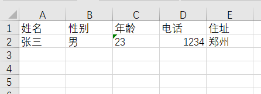
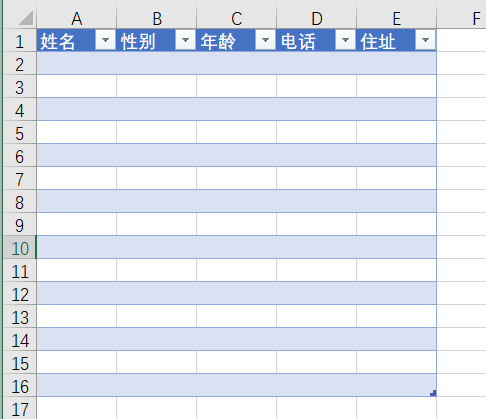
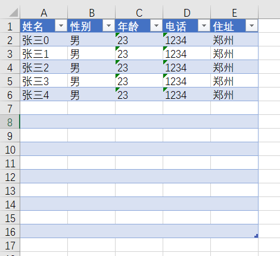
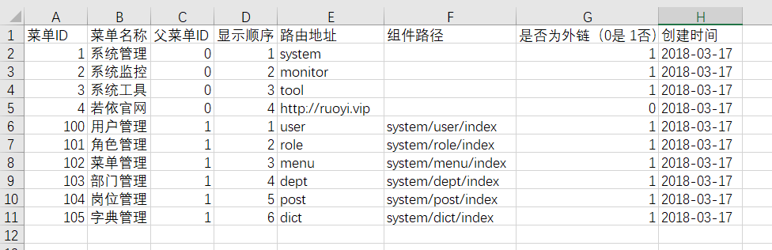

# 读写Excel表格
## 加入依赖
``` pom
<dependency>
    <groupId>org.apache.poi</groupId>
    <artifactId>poi</artifactId>
    <version>4.1.2</version>
</dependency>
<dependency>
    <groupId>org.apache.poi</groupId>
    <artifactId>poi-ooxml</artifactId>
    <version>4.1.2</version>
</dependency>
```
## 创建Excel表格，并写入数据
``` java
        Workbook wk = new XSSFWorkbook();
        Sheet sheet = wk.createSheet("通讯录");
        //第一行
        Row row = sheet.createRow(0);
        Cell cell = row.createCell(0);//第一列
        cell.setCellValue("姓名");
        cell = row.createCell(1);//第二列
        cell.setCellValue("性别");
        cell = row.createCell(2);//第三列
        cell.setCellValue("年龄");
        cell = row.createCell(3);
        cell.setCellValue("电话");
        cell = row.createCell(4);
        cell.setCellValue("住址");
        //第二行
        row = sheet.createRow(1);
        cell = row.createCell(0);
        cell.setCellValue("张三");
        cell = row.createCell(1);
        cell.setCellValue("男");
        cell = row.createCell(2);
        cell.setCellValue("23");
        cell = row.createCell(3);
        cell.setCellValue("123456789");
        cell = row.createCell(4);
        cell.setCellValue("郑州");
        OutputStream outputStream = new FileOutputStream("D:\\a.xlsx");
        wk.write(outputStream);
```

## 读取已有的Excel模板
>已有一个template.xlsx


``` java
        //拿到template中的样式和数据
        Workbook wk = WorkbookFactory.create(new File("D:\\template.xlsx"));
        Sheet sheet = wk.getSheetAt(0);//通过索引获取页面，可以使用页面名 wk.getSheet("通讯录")
        for (int i = 0; i < 5; i++) {
            Row row = sheet.createRow(i+1);
            Cell cell = row.createCell(0);
            cell.setCellValue("张三"+i);
            cell = row.createCell(1);
            cell.setCellValue("男");
            cell = row.createCell(2);
            cell.setCellValue("23");
            cell = row.createCell(3);
            cell.setCellValue("1234");
            cell = row.createCell(4);
            cell.setCellValue("郑州");
        }
        OutputStream outputStream = new FileOutputStream("D:\\a.xlsx");
        wk.write(outputStream);
```

## 将数据库表数据转成excel文件
>controller
``` java
@RequestMapping("list")
    public void list(HttpServletResponse response) throws IOException, IllegalAccessException {
        ExcelUtil<SysMenu> excelUtil = new ExcelUtil<>();
        Page page = sysMenuService.queryAll();
        excelUtil.createExcle(page.getList(),"表格.xlsx","菜单",response);
    }
```
>ExcelUtil
``` java
public class ExcelUtil<T> {
    public void createExcle(List<T> list, String fileName, String shellName, HttpServletResponse response) throws IllegalAccessException, IOException {
        Workbook wk = new XSSFWorkbook();
        Sheet sheet = wk.createSheet(shellName);
        Row row = sheet.createRow(0);
        Field[] fields = list.get(0).getClass().getDeclaredFields();
        int index = 0;
        for (int i = 0; i < fields.length; i++) {
            Excel excel = fields[i].getAnnotation(Excel.class);
            if (excel != null) {
                Cell cell = row.createCell(index);
                cell.setCellValue(excel.value());
                index++;
            }
        }
        for (int i = 0; i < list.size(); i++) {
            row = sheet.createRow(i + 1);
            index = 0;
            for (int j = 0; j < fields.length; j++) {
                Excel excel = fields[j].getAnnotation(Excel.class);
                if (excel != null) {
                    fields[j].setAccessible(true);
                    Object a = fields[j].get(list.get(i));
                    if (fields[j].get(list.get(i)) != null) {
                        Cell cell = row.createCell(index);
                        setCellValue(cell, fields[j].get(list.get(i)), fields[j].getType());
                    }
                    index++;
                }
            }
        }
        response.setContentType("application/vnd.ms-excel");
        response.setHeader("Content-Disposition", "attachment;filename=" + URLEncoder.encode(fileName, "UTF-8"));
        wk.write(response.getOutputStream());
    }

    /**
     * 为cell赋值的方法
     * @param cell 列
     * @param val   值
     * @param type  值的类型
     */
    public void setCellValue(Cell cell, Object val, Class type) {
        if (type.equals(String.class)) {
            cell.setCellValue(val.toString());
        } else if (type.equals(Long.class)) {
            cell.setCellValue(Long.parseLong(val.toString()));
        } else if (type.equals(byte.class)) {
            cell.setCellValue(Byte.parseByte(val.toString()));
        } else if (type.equals(int.class)||type.equals(Integer.class)) {
            cell.setCellValue(Integer.parseInt(val.toString()));
        } else if (type.equals(char.class)||type.equals(Character.class)) {
            cell.setCellValue(val.toString().toCharArray()[0] + val.toString().toCharArray()[1]);
        } else if (type.equals(Long.class)) {
            cell.setCellValue(Long.parseLong(val.toString()));
        } else if (type.equals(float.class)) {
            cell.setCellValue(Float.parseFloat(val.toString()));
        } else if (type.equals(double.class)) {
            cell.setCellValue(Double.parseDouble(val.toString()));
        } else if (type.equals(boolean.class)) {
            cell.setCellValue(Boolean.parseBoolean(val.toString()));
        } else if (type.equals(short.class)) {
            cell.setCellValue(Short.parseShort(val.toString()));
        } else if (type.equals(Date.class)) {
            SimpleDateFormat sdf = new SimpleDateFormat("yyyy-MM-dd");
            Date date = new Date(String.valueOf(val));
            cell.setCellValue(sdf.format(date));
        }
    }

}
```
