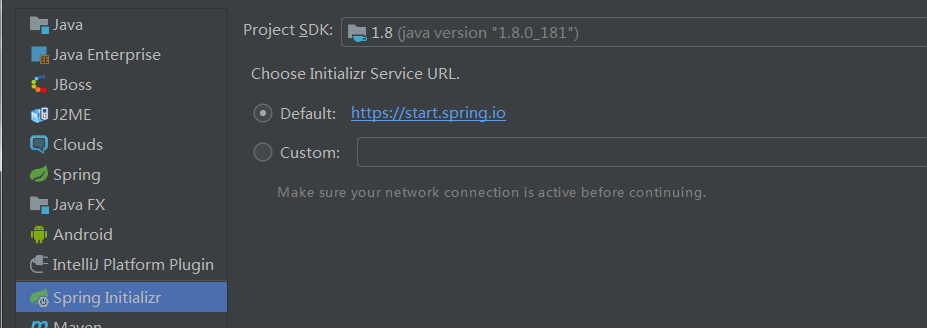
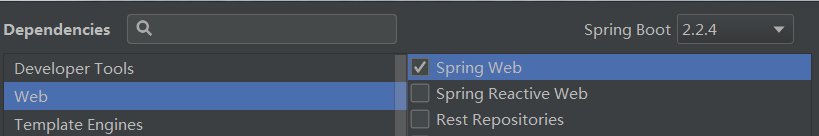
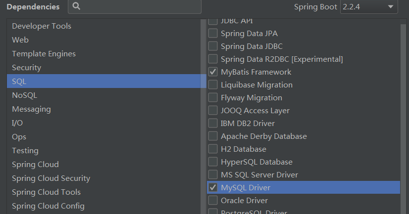

# IDE（集成开发环境）
> IDEA  :arrow_right:一点个人小看法  
> Jetbrain公司的产品，和webstorm是同一家公司，所以在前端编码方面非常方便。  
> 它使用的远程模板，通过远程模板去调配我们所需要的包，这些包有对应的版本维护。（基于maven）  
> 它对常用的生态链里的组件集成的比较好，GIT、SVN、MAVEN、SPRINGBOOT、SPRING CLOUD等

# 框架搭建步骤

1. 选择创建 spring boot项目

2. 选择需要的模块



# 配置属性文件
``` properties
# 配置数据源
spring.datasource.driver-class-name=com.mysql.cj.jdbc.Driver
spring.datasource.url=jdbc:mysql://localhost:3306/easybuy?characterEncoding=utf-8&serverTimezone=GMT%2B8
spring.datasource.username=root
spring.datasource.password=123

#配置MYBATIS映射文件
mybatis.mapper-locations=classpath:mapper/*.xml

#输出sql语句
mybatis.configuration.log-impl=org.apache.ibatis.logging.stdout.StdOutImpl

#JSON日期格式处理
spring.jackson.date-format=yyyy-MM-dd HH:mm:ss
spring.jackson.time-zone=GMT+8
```
# 相关注解

``` java
@SpringBootApplication
@MapperScan("com.example.gen.dao")
public class GenApplication {

    public static void main(String[] args) {
        SpringApplication.run(GenApplication.class, args);
    }

}
```

``` java
@RestController
public class GenController {
    ...
@GetMapping("gen")
public List<Map<String,Object>> showColumns(String tableName){
    ...
```
* MapperScan 描述MYBATIS接口的所在包
* RestController 表示该控制器所有方法均返回JSON
* GetMapping 表示GET方式请求，类似的还有 PostMapping PutMapping DeleteMapping 等  

# 自动生成代码插件
> easy code  

在settings中搜索plugins点击 browse responstories 按钮，搜索 easy coce 进行安装。

在数据库视图，选择表点右键进行代码生成。
# 跨域设置
> 单独设置

在控制器类上加上：  
@CrossOrigin("https://blog.csdn.net") // 只有指定域名可以访问该类下所有方法  
@CrossOrigin("*") // 随意跨域访问  

> 集中设置
```java
@Configuration
public class CorsConfig implements WebMvcConfigurer {

    @Bean
    public WebMvcConfigurer corsConfigurer()
    {
        return new WebMvcConfigurer() {
            @Override
            public void addCorsMappings(CorsRegistry registry) {
                registry.addMapping("/**").
                        allowedOrigins("https://www.dustyblog.cn"). //允许跨域的域名，可以用*表示允许任何域名使用
                        allowedMethods("*"). //允许任何方法（post、get等）
		                allowedHeaders("*"). //允许任何请求头
                        allowCredentials(true). //带上cookie信息
                        exposedHeaders(HttpHeaders.SET_COOKIE).maxAge(3600L); //maxAge(3600)表明在3600秒内，不需要再发送预检验请求，可以缓存该结果
            }
        };
    }
}

```