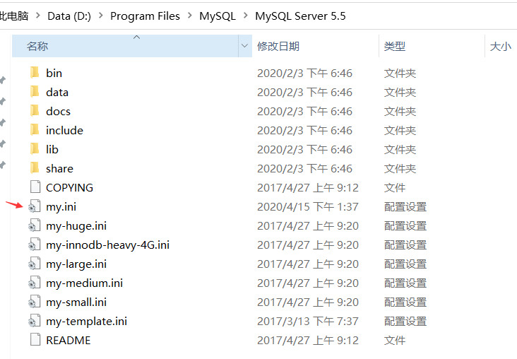
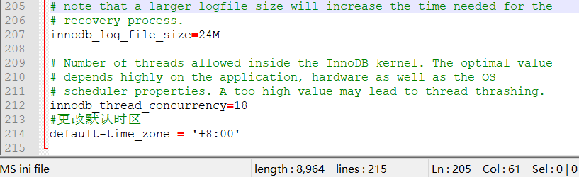

# 关于mysql时区问题的解决方法
>执行sql语句
``` sql
set tiem_zone = '+8:00' 
```
>修改配置文件

在mysql安装目录下打开my.ini



my.ini配置文件中配置
``` ini
default-time_zone = '+8:00'
```
然后重启mysql服务



>sql连接语句

在项目中的sql连接语句后追加serverTimezone=GMT%2B8
``` properties
spring.datasource.url=jdbc:mysql://localhost:3306/easybuy?characterEncoding=utf-8&serverTimezone=GMT%2B8
```

``` properties
# jackson时间格式化
spring.jackson.time-zone=GMT+8
spring.jackson.date-format=yyyy-MM-dd HH:mm:ss

```