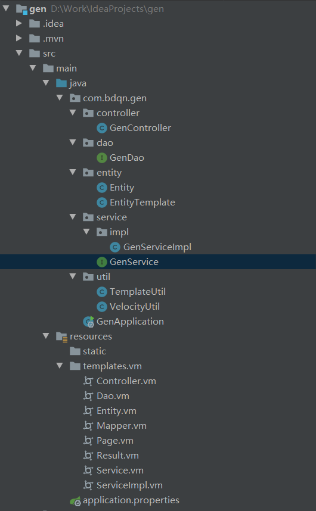

# Velocity加载vm文件生成代码
>## 项目总体

>## 加入依赖
 ``` pom.xml
 <!--加入velocity依赖-->
<dependency>
    <groupId>org.springframework.boot</groupId>
    <artifactId>spring-boot-starter-velocity</artifactId>
    <version>1.4.7.RELEASE</version>
</dependency>
```
>## 创建vm模板
>> ### Entity.vm
``` vm
package ${template.packagePath}.entity;
import java.util.Date;
public class ${template.className}{
#foreach(${entity} in ${template.entitys})
    //${entity.comment}
    private ${entity.typeName} ${entity.name};
    public ${entity.typeName} get${entity.uname}(){
        return this.${entity.name};
    }
    public void set${entity.uname}(${entity.typeName} ${entity.name}){
        this.${entity.name} = ${entity.name};
    }
#end
}
```
>> ### Dao.vm
``` vm
package ${template.packagePath}.dao;
import org.apache.ibatis.annotations.*;
import ${template.packagePath}.entity.${template.className};
import java.util.List;
@Mapper
public interface ${template.className}Dao{
    @Insert("insert into ${template.tableName}(${template.columnStr}) values(${template.propertiesStr})")
    public int add(${template.className} ${template.lclassName});
    @Delete("delete from ${template.tableName} where ${template.PKName} = #{id}")
    public int del(int id);
    @Select("select ${template.columnStrAll} from ${template.tableName} where ${template.PKName} = #{id}")
    public ${template.className} queryOne(int id);
    @Update("update ${template.className} set ${template.columnAndProp} where ${template.PKName} = #{id}")
    public int update(${template.className} ${template.lclassName});
    List<${template.className}> queryAllByLimit(@Param("offset") int offset, @Param("limit") int limit,@Param("where") ${template.className} where);
    public int queryRowCount(@Param("where") ${template.className} where);
}
```
>> ### Mapper.vm
``` vm
<?xml version="1.0" encoding="UTF-8"?>
<!DOCTYPE mapper PUBLIC "-//mybatis.org//DTD Mapper 3.0//EN" "http://mybatis.org/dtd/mybatis-3-mapper.dtd">
<mapper namespace="${template.packagePath}.dao.${template.className}Dao">
    <sql id="where">
        <where>
            #foreach(${entity} in ${template.entitys})
                <if test="where.${entity.name} != null and where.${entity.name} != ''">
                    and ${entity.columnName} like concat('%', #{where.${entity.name}},'%')
                </if>
            #end
        </where>
    </sql>
    <resultMap id="${template.className}Map" type="${template.packagePath}.entity.${template.className}">
        #foreach(${entity} in ${template.entitys})
            <result column="${entity.columnName}" property="${entity.name}" javaType="${entity.javaType}"/>
        #end
    </resultMap>
    <select id="queryAllByLimit" resultMap="${template.className}Map">
        select
        ${template.PKName},${template.columnStr}
        from ${template.tableName}
        <include refid="where"></include>
        limit #{offset}, #{limit}
    </select>
    <select id="queryRowCount" resultType="int" >
        select count(1) from ${template.tableName}
        <include refid="where"></include>
    </select>

</mapper>
```
>> ### Sevice.vm
```
package ${template.packagePath}.service;
import ${template.packagePath}.entity.${template.className};
import ${template.packagePath}.util.Page;
public interface ${template.className}Service{
    public int add(${template.className} ${template.lclassName});
    public int del(int id);
    public ${template.className} queryOne(int id);
    public int update(${template.className} ${template.lclassName});
    public Page queryAllByLimit(int offset,int limit,${template.className} where);
    public int queryRowCount(${template.className} where);
}
```
>> ### SeviceImpl.vm
```
package ${template.packagePath}.service.impl;
import ${template.packagePath}.dao.${template.className}Dao;
import ${template.packagePath}.entity.${template.className};
import ${template.packagePath}.service.${template.className}Service;
import ${template.packagePath}.util.Page;
import org.springframework.stereotype.Service;
import javax.annotation.Resource;
@Service
public class ${template.className}ServiceImpl implements ${template.className}Service{
    @Resource
    private ${template.className}Dao ${template.lclassName}Dao;
    public int add(${template.className} ${template.lclassName}){
        return ${template.lclassName}Dao.add(${template.lclassName});
    }
    public int del(int id){
        return ${template.lclassName}Dao.del(id);
    };
    public ${template.className} queryOne(int id){
        return ${template.lclassName}Dao.queryOne(id);
    };
    public int update(${template.className} ${template.lclassName}){
        return ${template.lclassName}Dao.update(${template.lclassName});
    };
    public Page queryAllByLimit(int pageNo,int pageSize,${template.className} where){
        return new Page(pageNo,${template.lclassName}Dao.queryRowCount(where),pageSize,${template.lclassName}Dao.queryAllByLimit((pageNo-1)*pageSize,pageSize,where));
    };
    public int queryRowCount(${template.className} where){
        return ${template.lclassName}Dao.queryRowCount(where);
    };
}
```
>> ### Controller.vm
```
package ${template.packagePath}.controller;

import ${template.packagePath}.entity.${template.className};
import ${template.packagePath}.service.${template.className}Service;
import ${template.packagePath}.util.Result;
import ${template.packagePath}.util.Page;
import org.springframework.web.bind.annotation.GetMapping;
import org.springframework.web.bind.annotation.RequestMapping;
import org.springframework.web.bind.annotation.RestController;
import javax.annotation.Resource;

@RestController
@RequestMapping("${template.lclassName}")
public class ${template.className}Controller {
    @Resource
    private ${template.className}Service ${template.lclassName}Service;
    @RequestMapping("add")
    public Result add(${template.className} ${template.lclassName}){
        Result result = new Result();
        try {
            ${template.lclassName}Service.add(${template.lclassName});
            result.setCode(200);
            result.setMessage("添加成功！");
        } catch (Exception e) {
            result.setCode(500);
            result.setMessage("错误："+e.getMessage());
        }
        return result;
    }
    @RequestMapping("del")
    public Result del(int id){
        Result result = new Result();
        try {
            ${template.lclassName}Service.del(id);
            result.setCode(200);
            result.setMessage("删除成功！");
        }catch (Exception e){
            result.setCode(500);
            result.setMessage("错误："+e.getMessage());
        }
        return result;
    }
    @RequestMapping("queryOne")
    public Result queryOne(int id){
        Result result = new Result();
        try {
            ${template.className} ${template.lclassName} = this.${template.lclassName}Service.queryOne(id);
            result.setCode(200);
            result.setMessage("查询成功！");
            result.setData(${template.lclassName});
        } catch (Exception e) {
            result.setCode(500);
            result.setMessage("错误："+e.getMessage());
        }
        return result;
    }
    @RequestMapping("update")
    public Result update(${template.className} ${template.lclassName}){
        Result result = new Result();
        try {
            ${template.lclassName}Service.update(${template.lclassName});
            result.setCode(200);
            result.setMessage("修改成功！");
        }catch (Exception e){
            result.setCode(500);
            result.setMessage("错误："+e.getMessage());
        }
        return result;
    }
    @RequestMapping("queryAll")
    public Result queryAllByLimit(@RequestParam(defaultValue = "1") int pageNo,@RequestParam(defaultValue = "5") int pageSize,${template.className} where){
        Result result = new Result();
        try {
            Page page = ${template.lclassName}Service.queryAllByLimit(pageNo,pageSize,where);
            result.setCode(200);
            result.setMessage("查询成功！");
            result.setData(page);
        }catch (Exception e){
            result.setCode(500);
            result.setMessage("错误："+e.getMessage());
        }
        return result;
    }
}

```
>> ### Page.vm
```
package ${template.packagePath}.util;

import java.util.List;

public class Page {
    private int PageNo;
    private int rowCount;
    private int pageSize;
    private List list;

    public Page(int pageNo, int rowCount, int pageSize, List list) {
        PageNo = pageNo;
        this.rowCount = rowCount;
        this.pageSize = pageSize;
        this.list = list;
    }

    public Page(){};

    public int getPageNo() {
        return PageNo;
    }

    public void setPageNo(int pageNo) {
        PageNo = pageNo;
    }

    public int getRowCount() {
        return rowCount;
    }

    public void setRowCount(int rowCount) {
       this.rowCount = rowCount;
    }

    public int getPageSize() {
       return pageSize;
    }

    public void setPageSize(int pageSize) {
      this.pageSize = pageSize;
    }

    public List getList() {
        return list;
    }

    public void setList(List list) {
        this.list = list;
    }
}

```
>> ### Result.vm
```
package ${template.packagePath}.util;

public class Result {
    private int Code;
    private String Message;
    private Object data;

    public Result(int code, String message, Object data) {
        Code = code;
        Message = message;
        this.data = data;
    }
    public Result(){};
        public int getCode() {
        return Code;
    }

    public void setCode(int code) {
        Code = code;
    }

    public String getMessage() {
        return Message;
    }

    public void setMessage(String message) {
        Message = message;
    }

    public Object getData() {
        return data;
    }

    public void setData(Object data) {
        this.data = data;
    }
}
```
>>## 代码实现
>> 自定义全局属性
``` properties
databaseName = ry
packagePath = com.bdqn.gen2
```
>>### TemplateUtil
``` java
public class TemplateUtil {
    //通过表名获取类名（去除下划线，每个单词首字母大写）
    //同时可以用于获取get set 方法名
    public static String getClassName(String tableName) {
        String[] strs = tableName.split("_");
        if(strs.length==0){
            return getFistUpperCase(tableName);
        }
        String className = "";
        for (int i=0;i<strs.length;i++) {
            className += getFistUpperCase(strs[i]);
        }
        return className;
    }
    //通过列名获取属性名（去除下划线，除了第一单词其余的首字母大写）
    //同样可以获取当前类的属性名
    public static String getPropertiesName(String columnName) {
        String[] strs = columnName.split("_");
        if(strs.length==0){
            return columnName;
        }
        String className = strs[0];
        for (int i=1;i<strs.length;i++) {
            className += getFistUpperCase(strs[i]);
        }
        return className;
    }
    //把字符串转成首字母大写
    public static String getFistUpperCase(String str) {
        char[] chs = str.toCharArray();
        //只有首字母是小写时转换
        if (chs[0] >= 'a' && chs[0] <= 'z'){
            chs[0] -= 32;
        }
        return String.valueOf(chs);
    }
    //用于通过数据库数据类型获取对应的java数据类型
    public static Map<String, String> typeMapping = new HashMap<>();
    static {
        typeMapping.put("int","Integer");
        typeMapping.put("bigint","Long");
        typeMapping.put("varchar","String");
        typeMapping.put("date","Date");
        typeMapping.put("datetime","Date");
        typeMapping.put("char","Character");
    }
}
```
>>### VelocityUtil
``` java
public class VelocityUtil {
    //生成代码 参数（vm所需数据,vm文件路径,创建到路径,文件名）
    public static Boolean createCode(EntityTemplate template, String vmPath, String createPath,String fileName) {
        //创建VelocityContext 向里面put vm文件需要的值
        VelocityContext context = new VelocityContext();
        context.put("template", template);

        //初始化Velocity引擎（加载配置）
        Properties p = new Properties();
        p.setProperty(RuntimeConstants.RESOURCE_LOADER,"classpath");
        //设置输入输出字符集
        p.setProperty(Velocity.INPUT_ENCODING, "UTF-8");
        p.setProperty(Velocity.OUTPUT_ENCODING, "UTF-8");
        //加载classpath目录下的vm文件
        p.setProperty("classpath.resource.loader.class", ClasspathResourceLoader.class.getName());
        Velocity.init(p);
        //获取处理之后生成的数据
        Template t = Velocity.getTemplate(vmPath);
        StringWriter sw = new StringWriter();
        t.merge(context, sw);//数据会放入sw中
        try {
            File file = new File(createPath);
            if(!file.exists()){
                file.mkdirs();
            }
            //使用输出流输出数据为代码文件
            FileWriter fileWriter = new FileWriter(file+"/"+fileName);
            fileWriter.write(sw.toString());
            fileWriter.close();
            return true;
        } catch (IOException e) {
            e.printStackTrace();
            return false;
        }
    }
}
```
>>业务逻辑

>>### EntityTemplate
``` java
public class EntityTemplate {
    private String className;//类名
    private String tableName;//表名
    private String lclassName;//类名小写
    private List<Entity> entitys = new ArrayList<>(); //属性
    private String columnStr;//全列名字符串
    private String columnStrAll;//所有列名字符串
    private String propertiesStr;//全属性名字符串
    private String packagePath;//包名
    private String PKName;//主键
    private String columnAndProp;//列名和属性名组合字符串
    public void addEntitys(Entity entity) {
        this.entitys.add(entity);
    }
    //省略get set 方法
}
```
>>### Entity
``` java
public class Entity {
    private String typeName;//类型名
    private String columnName;//字段名
    private String name;//属性名
    private String uname;//属性名大写
    private String comment;//概述
    private String javaType;
    public String getJavaType() {
        if(typeName.equals("Date")){
            javaType = "java.util.Date";
        }else{
            javaType = "java.lang." + typeName;
        }
        return javaType;
    }
    //省略get set 方法
}
```
>>### GenDao
``` java
public interface GenDao {
    @Select("select column_name,column_comment,data_type,column_key,column_type from information_schema.columns where table_name = #{tableName} and table_schema = #{dataBaseName}")
    List<Map<String,Object>> queryColumns(@Param("tableName") String tableName,@Param("dataBaseName")String dataBaseName);
}
```
>>### GenServiceImpl
``` java
@Service
public class GenServiceImpl implements GenService {
    @Resource
    GenDao genDao;
    @Value("${databaseName}")
    private String dataBaseName;//数据库名
    @Value("${packagePath}")
    private String packagePath;//包名
    @Override//将获取的列数据，转换成java数据
    public EntityTemplate queryColumns(String tableName) {
        List<Map<String, Object>> list = genDao.queryColumns(tableName,dataBaseName);
        EntityTemplate template = new EntityTemplate();
        template.setClassName(TemplateUtil.getClassName(tableName));
        template.setTableName(tableName);
        template.setLclassName(TemplateUtil.getPropertiesName(tableName));
        template.setPackagePath(packagePath);
        String columnStr = "";
        String columnStrAll = "";
        String propertiesStr = "";
        String columnAndProp = "";
        for(Map<String,Object> map : list){
            Entity e = new Entity();
            //调用工具类方法转换为java数据
            e.setTypeName(TemplateUtil.typeMapping.get(map.get("data_type").toString()));
            e.setName(TemplateUtil.getPropertiesName(map.get("column_name").toString()));
            e.setColumnName(map.get("column_name").toString());
            e.setUname(TemplateUtil.getClassName(map.get("column_name").toString()));
            e.setComment(map.get("column_comment").toString());
            columnStrAll += map.get("column_name")+",";
            //过滤主键字段
            if(!map.get("column_key").equals("PRI")){
                columnStr += map.get("column_name")+",";
                propertiesStr += "#{"+e.getName()+"},";
                columnAndProp += map.get("column_name") + " = " +"#{"+e.getName()+"},";
            }else{
                template.setPKName(map.get("column_name").toString());
            }
            template.addEntitys(e);
        }
        //去除字符串最后一个逗号
        template.setColumnStr(columnStr.substring(0, columnStr.length()-1));
        template.setColumnStrAll(columnStrAll.substring(0, columnStrAll.length()-1));
        template.setPropertiesStr(propertiesStr.substring(0, propertiesStr.length()-1));
        template.setColumnAndProp(columnAndProp.substring(0, columnAndProp.length()-1));
        return template;
    }
}
```
>>### GenController
``` java
@RestController
@RequestMapping("gen")
public class GenController {
    @Resource
    private GenService genService;
    @GetMapping("createCode")
    public void createCode(String tableName){
        EntityTemplate template = genService.queryColumns(tableName);
        //获取绝对路径
        String fullPath = System.getProperty("user.dir")+"\\src\\main\\java\\"+template.getPackagePath().replace(".","\\")+"\\";
        //生成工具类Page Result
        VelocityUtil.createCode(template,"templates\\vm\\Page.vm",fullPath+"util\\","Page.java");
        VelocityUtil.createCode(template,"templates\\vm\\Result.vm",fullPath+"util\\","Result.java");
        //生成实体类
        VelocityUtil.createCode(template,"templates\\vm\\Entity.vm",fullPath+"entity\\",template.getClassName()+".java");
        //生成dao类
        VelocityUtil.createCode(template,"templates\\vm\\Dao.vm",fullPath+"dao\\",template.getClassName()+"Dao"+".java");
        //生成mapper
        VelocityUtil.createCode(template,"templates\\vm\\Mapper.vm",System.getProperty("user.dir")+"\\src\\main\\resources\\mapper\\",template.getClassName()+"Mapper"+".xml");
        //生成service类
        VelocityUtil.createCode(template,"templates\\vm\\Service.vm",fullPath+"service\\",template.getClassName()+"Service"+".java");
        //生成serviceImpl类
        VelocityUtil.createCode(template,"templates\\vm\\ServiceImpl.vm",fullPath+"service\\impl\\",template.getClassName()+"ServiceImpl"+".java");
        //生成controller类
        VelocityUtil.createCode(template,"templates\\vm\\controller.vm",fullPath+"controller\\",template.getClassName()+"Controller"+".java");
    }
}
```
