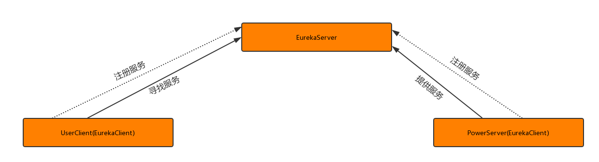
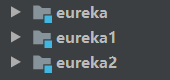
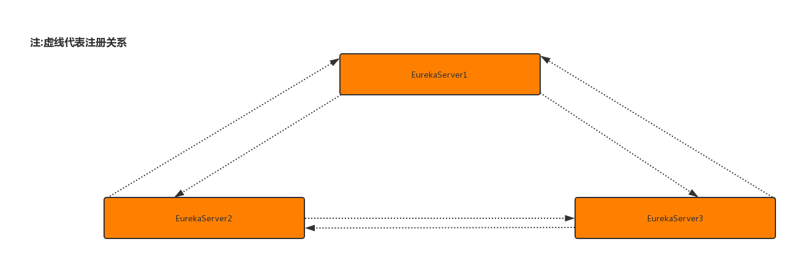
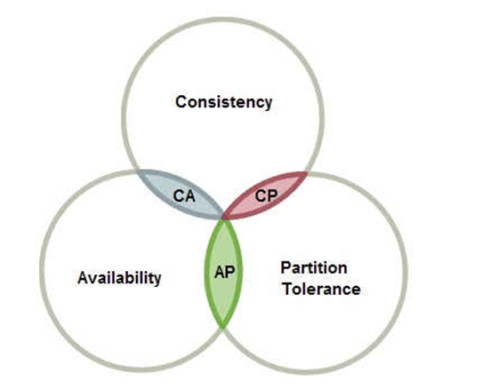

# Eureka：
## 认识Eureka
### eureka是什么？
 eureka是Netflix的子模块之一，也是一个核心的模块，eureka里有2个组件，一个是EurekaServer(一个独立的项目) 这个是用于定位服务以实现中间层服务器的负载平衡和故障转移，另一个便是EurekaClient（我们的微服务） 它是用于与Server交互的，可以使得交互变得非常简单:只需要通过服务标识符即可拿到服务。
### 与spring-cloud的关系：
Spring Cloud 封装了 Netflix 公司开发的 Eureka 模块来实现服务注册和发现(可以对比Zookeeper)。
Eureka 采用了 C-S 的设计架构。Eureka Server 作为服务注册功能的服务器，它是服务注册中心。
而系统中的其他微服务，使用 Eureka 的客户端连接到 Eureka Server并维持心跳连接。这样系统的维护人员就可以通过 Eureka Server 来监控系统中各个微服务是否正常运行。SpringCloud 的一些其他模块（比如Zuul）就可以通过 Eureka Server 来发现系统中的其他微服务，并执行相关的逻辑。
 角色关系图：


## 如何使用？
>在spring-cloud项目里面加入依赖：

eureka客户端：
``` xml
<dependency>
   <groupId>org.springframework.cloud</groupId>
   <artifactId>spring-cloud-starter-netflix-eureka-client</artifactId>
</dependency>
```
  eureka服务端：
``` xml
<dependency>
   <groupId>org.springframework.cloud</groupId>
   <artifactId>spring-cloud-starter-netflix-eureka-server</artifactId>
</dependency>
```
> 配置

eureka服务端项目里面加入以下配置：
``` yml
server:
    port: 3000
eureka:
    server:
      enable-self-preservation: false  #关闭自我保护机制
      eviction-interval-timer-in-ms: 4000 #设置清理间隔（单位：毫秒 默认是60*1000）
    instance:
      hostname: localhost
    client:
      registerWithEureka: false #不把自己作为一个客户端注册到自己身上
      fetchRegistry: false  #不需要从服务端获取注册信息（因为在这里自己就是服务端，而且已经禁用自己注册了）
      serviceUrl:
        defaultZone: http://${eureka.instance.hostname}:${server.port}/eureka
```
eureka客户端项目里面加入以下配置：
``` yml
server:
  port: 5000
eureka:
  client:
    serviceUrl:
      defaultZone: http://localhost:3000/eureka/  #eureka服务端提供的注册地址 参考服务端配置的这个路径
  instance:
    instance-id: user-1 #此实例注册到eureka服务端的唯一的实例ID
    prefer-ip-address: true #是否显示IP地址
    leaseRenewalIntervalInSeconds: 10 #eureka客户需要多长时间发送心跳给eureka服务器，表明它仍然活着,默认为30 秒 (与下面配置的单位都是秒)
    leaseExpirationDurationInSeconds: 30 #Eureka服务器在接收到实例的最后一次发出的心跳后，需要等待多久才可以将此实例删除，默认为90秒

spring:
  application:
    name: client-user #项目名 此实例注册到eureka服务端的name
```
## eureka集群:
### eureka集群原理
 服务启动后向Eureka注册，Eureka Server会将注册信息向其他Eureka Server进行同步，当服务消费者要调用服务提供者，则向服务注册中心获取服务提供者地址，然后会将服务提供者地址缓存在本地，下次再调用时，则直接从本地缓存中取，完成一次调用。
### eureka集群配置
 刚刚我们了解到 Eureka Server会将注册信息向其他Eureka Server进行同步 那么我们得声明有哪些server呢？
这里 假设我们有3个Eureka Server 如图：


多个eureka互相同步数据


修改每个eureka服务端配置，每个和另外两个建立连接
``` yml
 client:
    serviceUrl:
        defaultZone:http://eureka1.com:3001/eureka,http://eureka2.com:3002/eureka
```
## CAP定理：


1998年，加州大学的计算机科学家 Eric Brewer 提出，分布式系统有三个指标。

Consistency   ---一致性
Availability  ---可用性
Partition tolerance ---分区容错性

他们第一个字母分别是C,A,P
Eric Brewer 说，这三个指标不可能同时做到。这个结论就叫做 CAP 定理。

## eureka对比Zookeeper：
 Zookeeper在设计的时候遵循的是CP原则，即一致性,Zookeeper会出现这样一种情况，当master节点因为网络故障与其他节点失去联系时剩余节点会重新进行leader选举，问题在于，选举leader的时间太长：30~120s，且选举期间整个Zookeeper集群是不可用的，这就导致在选举期间注册服务处于瘫痪状态，在云部署的环境下，因网络环境使Zookeeper集群失去master节点是较大概率发生的事情，虽然服务能够最终恢复，但是漫长的选举时间导致长期的服务注册不可用是不能容忍的。
 Eureka在设计的时候遵循的是AP原则，即可用性。Eureka各个节点（服务)是平等的，没有主从之分，几个节点down掉不会影响正常工作，剩余的节点（服务） 依然可以提供注册与查询服务，而Eureka的客户端在向某个Eureka注册或发现连接失败，则会自动切换到其他节点，也就是说，只要有一台Eureka还在，就能注册可用（保证可用性）， 只不过查询到的信息不是最新的（不保证强一致），除此之外，Eureka还有自我保护机制，如果在15分钟内超过85%节点都没有正常心跳，那么eureka就认为客户端与注册中心出现了网络故障，此时会出现一下情况:
1:
Eureka 不再从注册列表中移除因为长时间没有收到心跳而过期的服务。
2：Eureka 仍然能够接收新服务的注册和查询请求，但是不会被同步到其它节点上（即保证当前节点可用）
3： 当网络稳定后，当前实例新的注册信息会被同步到其它节点中
