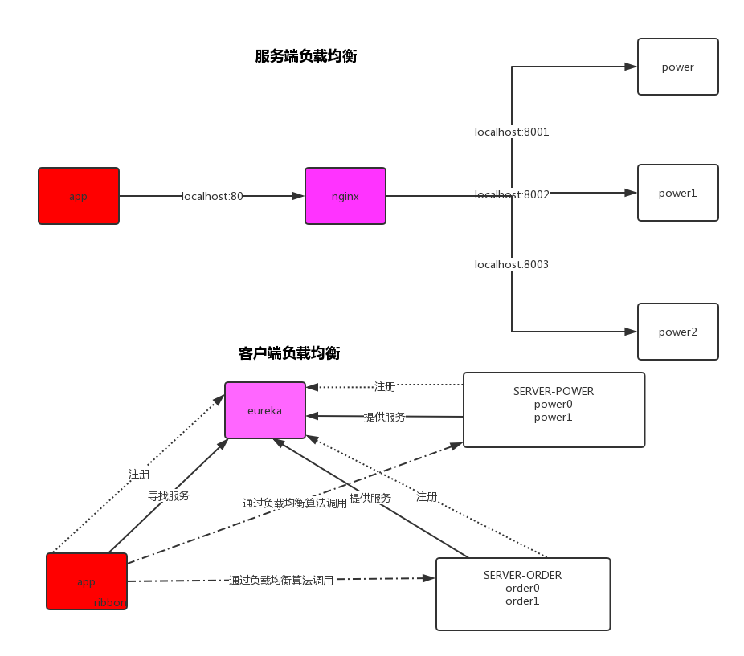
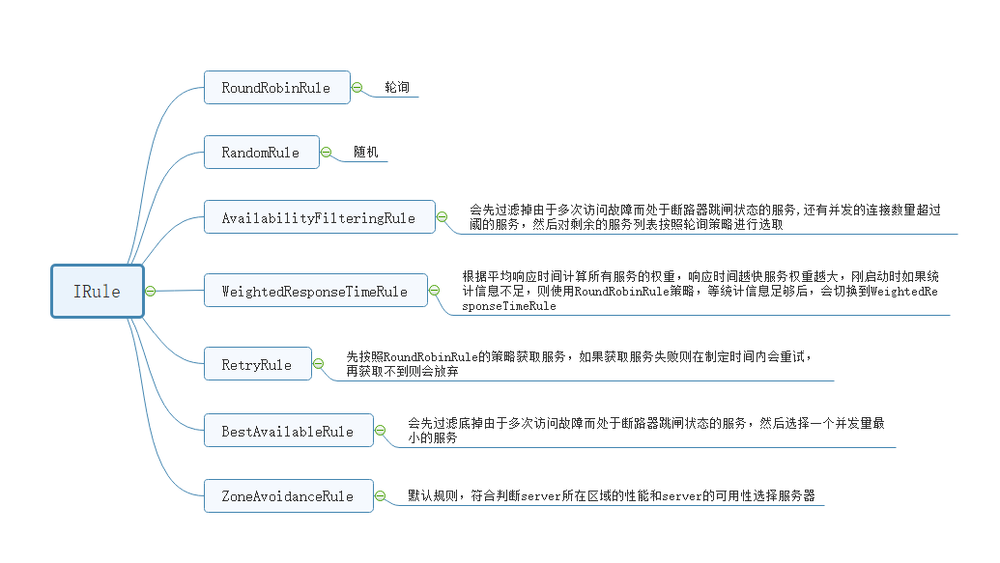

# Ribbon
## 认识Ribbon
### ribbon是什么?
Spring Cloud Ribbon是基于Netflix Ribbon实现的一套客户端负载均衡的工具。
简单的说，Ribbon是Netflix发布的开源项目，主要功能是提供客户端的软件负载均衡算法，将Netflix的中间层服务连接在一起。Ribbon客户端组件提供一系列完善的配置项如连接超时，重试等。简单的说，就是在配置文件中列出Load Balancer（简称LB）后面所有的机器，Ribbon会自动的帮助你基于某种规则（如简单轮询，随机连接等）去连接这些机器。我们也很容易使用Ribbon实现自定义的负载均衡算法。

### 客户端负载均衡？？ 服务端负载均衡?? 
>我们用一张图来描述一下这两者的区别


## 如何使用:
>这里不需要在引入依赖，因为eureka已经把ribbon集成到他的依赖里面去了
>
>配合restTemplate使用ribbon，只需要一个注解：```@LoadBalaced```

配置类
``` java
@Bean
@LoadBalanced
public RestTemplate restTemplate() {
    return new RestTemplate();
}
```
>访问注册ureka上的微服务，通过微服务项目名访问
>
>ribbon 有默认的负载均衡是轮询策略，也就是```轮询```
``` java
@Autowired
RestTemplate restTemplate;

@RequestMapping("getPower")
public R getPower() {
    return R.success("成功", restTemplate.getForObject("server-power/getPower",Object.class));
}
```
## 策略接口：IRule
>IRule是什么? 它是Ribbon对于负载均衡策略实现的接口， 怎么理解这句话？ 说白了就是你实现这个接口，就能自定义负载均衡策略，自定义我们待会儿来讲， 我们先来看看他有哪些默认的实现


>使用默认负载均衡策略,在配置类里配置
``` java
@Bean
public IRule iRule(){
    return  new RandomRule();返回负载均衡对象
}
```
### 自定义负载均衡策略：
>自定义负载均衡算法类继承 ```AbstractLoadBalanceRule``` 类
``` java
public class MyRule extends AbstractLoadBalancerRule {
    public MyRule() { }
    public void initWithNiwsConfig(IClientConfig clientConfig) { }
    public Server choose(Object key) {
        return this.choose(this.getLoadBalancer(), key);
    }
    public Server choose(ILoadBalancer lb, Object key) {
        if (lb == null) {
            return null;
        } else {
            Server server = null;
            while(server == null) {
                if (Thread.interrupted()) {
                    return null;
                }
                List<Server> upList = lb.getReachableServers();
                List<Server> allList = lb.getAllServers();
                int serverCount = allList.size();
                if (serverCount == 0) {
                    return null;
                }
                //allList总共集群个数，通过算法进行处理
                //然后获得index：就是这次要访问的集群中的某个编号
                int index = new Random().nextInt(allList.size());
                server = (Server)upList.get(index);
                if (server == null) {
                    Thread.yield();
                } else {
                    if (server.isAlive()) {
                        return server;
                    }
                    server = null;
                    Thread.yield();
                }
            }
            return server;
        }
    }
}
```
``` java
@Bean
public IRule iRule(){
    return  new MyRule();//返回自定义的负载均衡策略
}
```

## 对不同微服务使用不同的负载均衡策略
>为每个微服务创建一个负载均衡配置类
``` java
@Configuration
public class PowerRuleConfig {
    @Bean
    public IRule iRule() {
        return new RoundRobinRule();
    }
}
```
>在配置类上加```@RibbonClients```注解
>
>在注解里配置 value = 微服务名,configuration = 负载均衡配置类
``` java
@RibbonClients({
        @RibbonClient(value = "client-power", configuration = PowerRuleConfig.class),
        @RibbonClient(value = "client-order", configuration = OrderRuleConfig.class)
})
```
>！！！注意：负载均衡配置类不可以被自动扫描交给spring容器，所有有两种解决方法
>1. 不把负载均衡配置类放到springboot启动类的一系列包下
>2. 在配置类上添加排除扫描的类,如下代码
``` java
@ComponentScan(excludeFilters = {@Filter(type = FilterType.ASSIGNABLE_TYPE, 
classes = {OrderRuleConfig.class, PowerRuleConfig.class})})
```

