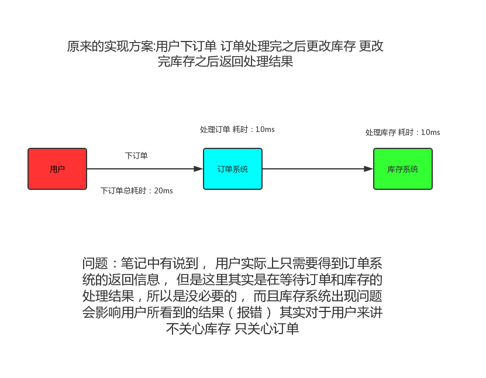
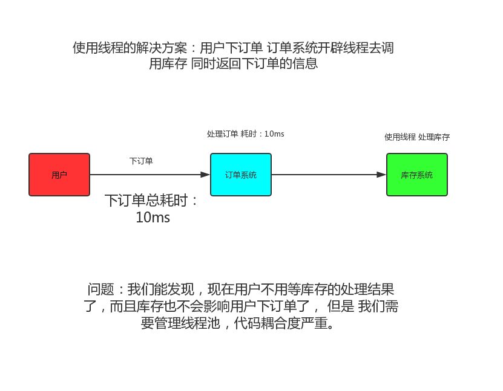
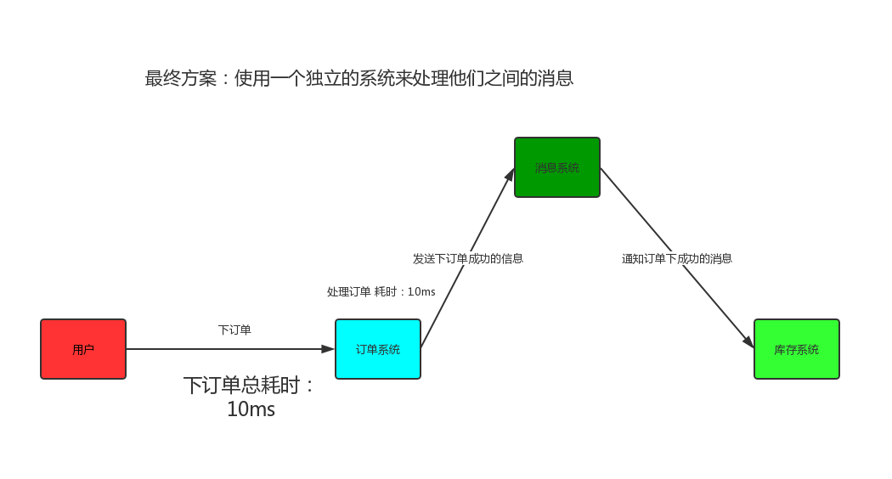

# RabbitMq
## 介绍
### 消息中间件介绍&为什么要使用消息中间件&什么时候使用消息中间件
我们用java来举例子， 打个比方 我们客户端发送一个下单请求给订单系统（order）订单系统发送了
一个请求给我们的库存系统告诉他需要更改库存了， 我已经下单了， 这里， 每一个请求我们都可以看作一条消息，
但是 我们客户端需要等待订单系统告诉我这条消息的处理结果（我到底有没有下单成功） 但是 订单系统不需要知道库存系统这条息的处理情况 因为无论你库存有没有改动成功， 我订单还是下了， 因为是先下完了订单（下成功了） 才去更改库存， 库存如果改出BUG了 那是库存系统的问题， 这个BUG不会影响订单系统。如果这里你能理解的话， 那么我们就能发现 我们用户发送的这条息（下订单）， 是需要同步的（我需要知道结果）， 订单发送给库存的消息，是可以异步的（我不想知道你库存到底改了没， 我是通知你我这边成功下了一个订单）
那么如果我们还按原来的方式去实现这个需求的话， 那么结果会是这样：

可以有人问： 我们订单系统开辟线程去访问库存系统不就好了吗？

使用线程池解决 确实可以， 但是也有他的缺点， 那么 到底怎么来完美解决这个问题呢？

如果这张图能理解的话， 那么这个消息系统， 就是我们的消息中间件。
### RabbitMq介绍&AMQP介绍 
导语:我们刚刚介绍了什么是消息中间件， 那么RabbitMq就是对于消息中间件的一种实现，市面上还有很多很多实现， 比如RabbitMq、ActiveMq、ZeroMq、kafka，以及阿里开源的RocketMQ等等 我们这节主要讲RabbitMq
