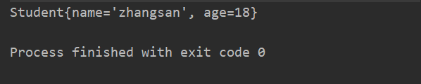

# Redis
REmote DIctionary Server(Redis) 是一个由Salvatore Sanfilippo写的key-value存储系统。

Redis是一个开源的使用ANSI C语言编写、遵守BSD协议、支持网络、可基于内存亦可持久化的日志型、Key-Value数据库，并提供多种语言的API。

它通常被称为数据结构服务器，因为值（value）可以是 字符串(String), 哈希(Hash), 列表(list), 集合(sets) 和 有序集合(sorted sets)等类型。

## 安装
### Window 下安装
> 下载地址：https://github.com/tporadowski/redis/releases


> 下载之后解压 然后运行redis-server.exe 启动redis服务


### Linux 下安装
> 下载地址：http://redis.io/download 下载最新稳定版本。
``` linux
$ wget http://download.redis.io/releases/redis-2.8.17.tar.gz
$ tar xzf redis-2.8.17.tar.gz
$ cd redis-2.8.17
$ make
```
> 启动 Redis
``` linux
$ redis-server
```

## java 普通使用
> 引入reids的支持jar包
``` xml
<dependency>
    <groupId>redis.clients</groupId>
    <artifactId>jedis</artifactId>
    <version>3.3.0</version>
</dependency>
```
>对象和byte数组相互转换的工具类
``` java
public class JedisUtil {
    public static byte[] toByteArray(Object o) throws IOException {
        ByteArrayOutputStream output = new ByteArrayOutputStream();
        ObjectOutputStream objectOutputStream = new ObjectOutputStream(output);
        objectOutputStream.writeObject(o);
        return output.toByteArray();
    }
    public static Object toObjcet(byte[] bytes) throws IOException, ClassNotFoundException {
        ByteArrayInputStream input = new ByteArrayInputStream(bytes);
        ObjectInputStream objectInputStream = new ObjectInputStream(input);
        return objectInputStream.readObject();
    }
}
```
>需要转换的对象的类必须实现Serializable序列化接口
``` java
public class Student implements Serializable {
    private String name;
    private int age;
    //get set toString
}
```
``` java
public static void main(String[] args) throws Exception {
    //与redis服务连接
    Jedis jedis = new Jedis("127.0.0.1");
    //将对象通过工具类转换为byte数组
    byte[] bytes = JedisUtil.toByteArray(new Student("zhangsan",18));
    //使用set方法把数据通过，k-v的形式存入reids数据库
    jedis.set("student".getBytes(), bytes);
    //使用get方法通过Key从redis数据库中取出数据，转换成对应对象
    Student student = (Student) JedisUtil.toObjcet(jedis.get("student".getBytes()));
    System.out.println(student);
}
```


## 实现缓存
### 使用redis和sprinAop实现缓存
> 引入reids的支持jar包、aspectj支持的jar包
``` xml
<dependency>
    <groupId>redis.clients</groupId>
    <artifactId>jedis</artifactId>
    <version>3.3.0</version>
</dependency>
<dependency>
    <groupId>aspectj</groupId>
    <artifactId>aspectjweaver</artifactId>
    <version>1.5.4</version>
</dependency>
```
>在配置类中加上开启aspectj自动代理的注解
并将jedis注入spring容器
``` java
@EnableAspectJAutoProxy

@Bean
public Jedis jedis() {
    return new Jedis();
}
```
>创建实现增强的Aop类
``` java
@Component
@Aspect
public class redisAop {
    @Autowired
    private Jedis jedis;
    //通过环绕增强实现缓存
    @Around("execution(* com.bdqn.easybuydata.controller.*.*(..))")
    public Object redisAround(ProceedingJoinPoint pjp) throws Throwable {
        //获取调用的类名+方法名+所有参数值组成唯一Key
        //注意：如果参数中对象类型，一定要让此对象重新toString方法返回属性值
        //     因为对象类型直接进行输出时候是输出的对象地址，同一个对象每次也都会发生变化
        String className = pjp.getTarget().getClass().getName();
        String requestName = pjp.getSignature().getName();
        Object[] argsArray = pjp.getArgs();
        String args = "";
        for (Object o : argsArray) {
            args += o;
        }
        String key = className + requestName + args;
        //判断redis数据库中是否存在，存在直接取出，不存在再去数据库获取，然后存入redis
        if (jedis.exists(key.getBytes())) {
            return JedisUtil.toObjcet(jedis.get(key.getBytes()));
        }else{
            Object result = pjp.proceed();
            jedis.set(key.getBytes(), JedisUtil.toByteArray(result));
            return result;
        }
    }
}
```